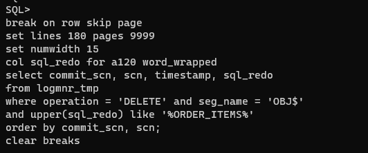
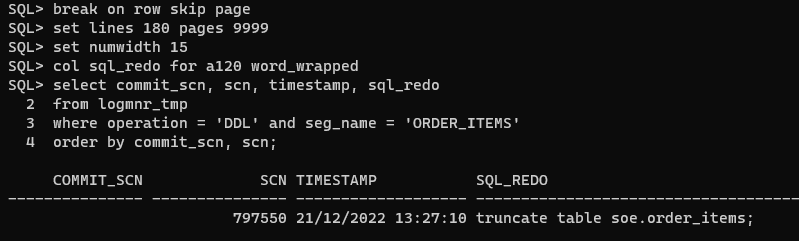
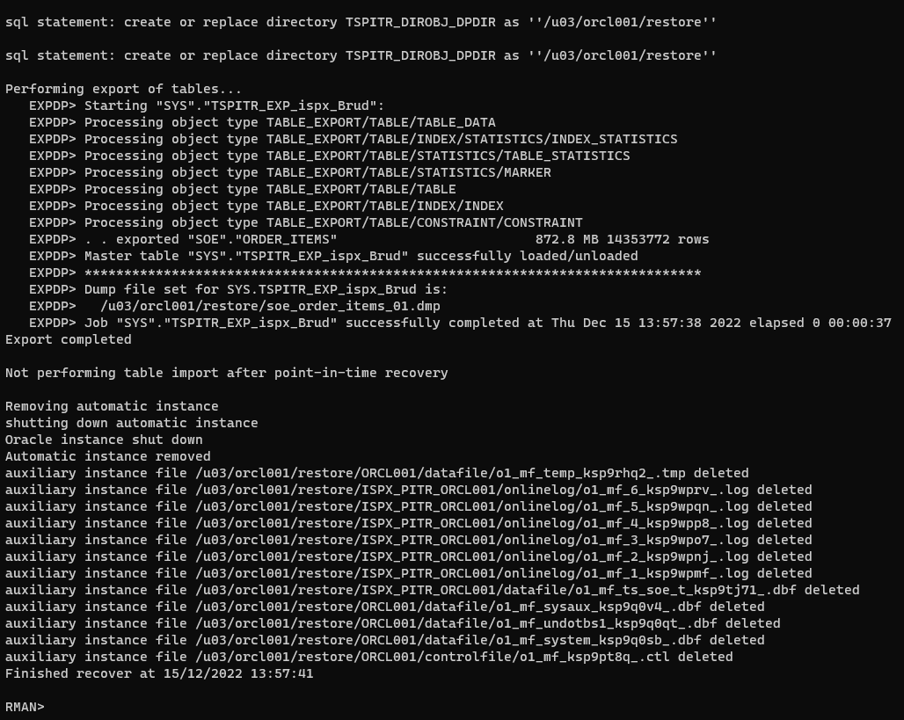
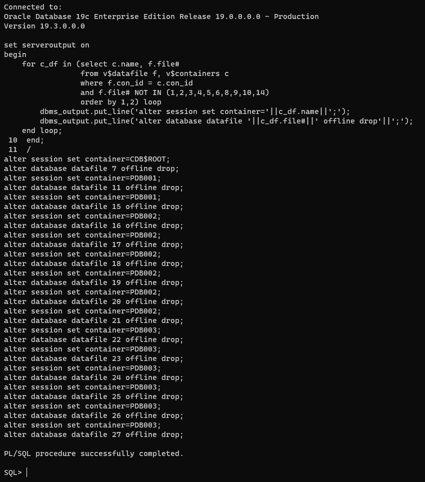

# Introdução

Neste documento será demonstrado como recuperar uma tabela usando os seguintes métodos:

* Flashback a partir da Recycle Bin
  * Pode ser usado somente quando a *recycle bin* está ativa e a tabela foi dropada sem a cláusula de *purge*
* Recover Table (disponível a partir da versão 12c)
  * Pode ser usado para recuperar de drop, truncate e insert/update/delete
* Restore parcial de base Single-Tenant
  * Pode ser usado para recuperar de drop, truncate e insert/update/delete
  * Recomendável que seja feito em outro servidor para evitar riscos de sobrescrever a base de origem ao esquecer comandos de rename
  * Indicado quando a versão utilizada não suporta o RMAN Recover Table ou é necessário um maior controle sobre a operação
* Restore parcial de PDB
  * Idem ao restore parcial de base Single-Tenant

Será usada como exemplo a tabela SOE.ORDER_ITEMS criada pelo [SwingBench](http://www.dominicgiles.com/swingbench/).

# Flashback a Partir da Recycle Bin

Caso a tabela tenha sido dropada sem a opção *PURGE*, é possível usar o comando `FLASHBACK TABLE <OWNER>.<TABLE NAME> TO BEFORE DROP`.

Verifique se a recycle bin está ativada:

```{.sql .numberLines}
show parameter recyclebin
```

Resultado esperado:

```{.sql .numberLines}
SQL> show parameter recyclebin

NAME                                 TYPE        VALUE
------------------------------------ ----------- ------------------------------
recyclebin                           string      on
SQL>
```

Verifique se a tabela está disponível na recycle bin para ser recuperada:

```{.sql .numberLines}
alter session set nls_date_format='dd/mm/yyyy hh24:mi:ss';
set lines 160
col owner for a30
col object_name for a30
col original_name for a30
col dropscn for 999999999999999
col base_object for 999999999999999

select owner, object_name, original_name, droptime, dropscn, base_object
from dba_recyclebin
where owner = upper('&OWNER')
and original_name = upper('&TABLE_NAME')
and type = 'TABLE'
order by dropscn desc nulls last;
```

Exemplo:


Obtenha os comandos de rename dos índices. O campo `dropscn` deve ser o informado no resultado da consulta anterior:

```{.sql .numberLines}
set lines 160
col cmd for a160

select 'alter index "'||owner||'"."'||object_name||'" rename to "'||original_name||'";' cmd
from dba_recyclebin
where related =
  (select base_object
   from dba_recyclebin
   where owner = upper('&OWNER')
   and original_name = upper('&TABLE_NAME')
   and dropscn = &DROPSCN)
and type = 'INDEX';
```

Exemplo:


A partir deste ponto há duas opções:

* Restaurar a tabela com o mesmo nome

  ```{.sql .numberLines}
  FLASHBACK TABLE <OWNER>.<TABLE_NAME> TO BEFORE DROP;
  ```

  Exemplo:

  

  Executar o rename dos índices:

  

* Restaurar a tabela com outro nome

  ```{.sql .numberLines}
  FLASHBACK TABLE <OWNER>.<TABLE_NAME> TO BEFORE DROP RENAME TO <TABLE_NAME>_<SUFIXO>;
  ```

  Exemplo:

  

O comando `FLASHBACK TABLE <OWNER>.<TABLE NAME> TO BEFORE DROP` não restaura constraints de referência a outras tabelas.
Essas constraints deverão ser recriadas de acordo com o script original de metadados da tabela, que deverá ser obtido
com o fornecedor da aplicação.

# Identificando o SCN do Comando de DROP TABLE / TRUNCATE TABLE / DELETE

## Inicialização do *LogMiner*

Caso seja necessário restaurar a tabela ao ponto imediatamente antes do `DROP`, é possível identificar via *LogMiner* o
SCN em que a tabela foi dropada.
É recomendável que esse levantamento do SCN seja executado apenas quando a necessidade de minimizar a perda de dados
seja maior do que a urgência do restore, uma vez que a execução do *LogMiner* aumenta o tempo da ativdade.

No exemplo abaixo, suponha que o solicitante tenha informado que o drop da tabela foi feito entre 17:00 e 19:00 do dia 14/12.
Sendo assim, precisamos disponibilizar os archives desse range de data para que possa ser feita a análise via *LogMiner*.

* Suspenda o backup de archives (via *crontab* ou equipe de Backup);

* Restaure os archives necessários, de preferência para uma área separada de archives:

  ```{.sql .numberLines}
  select max(first_change#) first_scn, max(first_time) first_time
  from v$archived_log
  where first_time <= to_date('<DATA INICIO>', 'DD/MM/YYYY HH24:MI');

  select min(next_change#) last_scn, min(next_time) last_time
  from v$archived_log
  where next_time >= to_date('<DATA FIM>', 'DD/MM/YYYY HH24:MI');
  ```

  Exemplo:

  

  ```{.default .numberLines}
  run {
      set archivelog destination to '<CAMINHO ALTERNATIVO>';
      restore force archivelog from scn <FIRST SCN DA CONSULTA ANTERIOR> until scn <LAST SCN DA CONSULTA ANTERIOR>;
  }
  ```

  Exemplo:

  

* Caso tenha usado um caminho alternativo para o restore, faça o `uncatalog` dos archives restaurados para evitar que sejam eliminados no backup/delete:

  ```{.default .numberLines}
  change archivelog like '<CAMINHO ALTERNATIVO>/%' uncatalog;
  ```

  Exemplo:

  

* Caso tenha feito o `uncatalog`, a partir desse ponto já é possível reativar o backup de archives;

* Popular a view `v$logmnr_contents` com o script abaixo:

  ```{.sql .numberLines}
  -- Deve ser incluida uma linha do comando EXECUTE DBMS_LOGMNR.ADD_LOGFILE para cada archive restaurado
  EXECUTE DBMS_LOGMNR.ADD_LOGFILE(LOGFILENAME => '<CAMINHO COMPLETO DO ARCHIVELOG>', OPTIONS => DBMS_LOGMNR.ADDFILE);

  -- Iniciar o logminer com as opcoes catalogo online, só dados commitados e a query formatada
  EXECUTE DBMS_LOGMNR.start_logmnr (OPTIONS => DBMS_LOGMNR.DICT_FROM_ONLINE_CATALOG + DBMS_LOGMNR.PRINT_PRETTY_SQL + DBMS_LOGMNR.COMMITTED_DATA_ONLY);
  ```

  Uma maneira rápida de gerar os comandos `EXECUTE DBMS_LOGMNR.ADD_LOGFILE` é executar o comando abaixo:

  ```{.bash .numberLines}
  find <CAMINHO ALTERNATIVO> -type f -print0 | sed -z -r "s/(.+)/EXECUTE DBMS_LOGMNR.ADD_LOGFILE(LOGFILENAME => '\1', OPTIONS => DBMS_LOGMNR.ADDFILE);\n/g"
  ```

  Exemplos:

  

  

* Crie uma tabela chamada *LOGMNR_TMP* com o conteúdo da view `v$logmnr_contents` e encerre o LogMiner:

  ```{.sql .numberLines}
  ALTER SESSION ENABLE PARALLEL QUERY;
  ALTER SESSION ENABLE PARALLEL DML;
  ALTER SESSION ENABLE PARALLEL DDL;

  CREATE TABLE LOGMNR_TMP
  PARALLEL 4
  TABLESPACE SYSAUX
  AS SELECT /*+ PARALLEL(T 4) NO_GATHER_OPTIMIZER_STATISTICS */ * FROM V$LOGMNR_CONTENTS T
  WHERE OPERATION in ('DELETE', 'DDL') AND SEG_NAME IN ('COL$','OBJ$','TAB$', <TABELA DESEJADA>);

  EXEC DBMS_STATS.GATHER_TABLE_STATS(OWNNAME=>'SYS', TABNAME=>'LOGMNR_TMP', DEGREE=>4, NO_INVALIDATE=>FALSE);

  EXECUTE DBMS_LOGMNR.END_LOGMNR();
  ```

  Exemplo:

  

## Identificando o SCN do comando de DROP TABLE

* Verifique na tabela *LOGMNR_TMP* o SCN e o timestamp em que foi feito o `DROP`:

  ```{.sql .numberLines}
  break on row skip page
  set lines 180 pages 9999
  set numwidth 15
  col sql_redo for a120 word_wrapped
  select commit_scn, scn, timestamp, sql_redo
  from logmnr_tmp
  where operation = 'DELETE' and seg_name = 'OBJ$'
  and upper(sql_redo) like '%<TABELA DESEJADA>%'
  order by commit_scn, scn;
  clear breaks
  ```

  Exemplo:

  

  

  Podemos ver nas imagens acima que a transação do `drop table` foi commitada no SCN 795875. Caso queira voltar a tabela
  ao ponto imediatamente anterior ao drop, deve-se usar o comando `SET UNTIL SCN 795875` no RMAN, uma vez que o RMAN faz
  o restore até o (SCN ESPECIFICADO) - 1.

  Caso a query acima não traga resultados, execute-a sem o filtro no campo `sql_redo`:

  ```{.sql .numberLines}
  break on row skip page
  set lines 180 pages 9999
  set numwidth 15
  col sql_redo for a120 word_wrapped
  select commit_scn, scn, timestamp, sql_redo
  from logmnr_tmp
  where operation = 'DELETE' and seg_name = 'OBJ$'
  order by commit_scn, scn;
  clear breaks
  ```

## Identificando o SCN do comando de TRUNCATE TABLE

* Verifique na tabela *LOGMNR_TMP* o SCN e o timestamp em que foi feito o `TRUNCATE`:

  ```{.sql .numberLines}
  break on row skip page
  set lines 180 pages 9999
  set numwidth 15
  col sql_redo for a120 word_wrapped
  select commit_scn, scn, timestamp, sql_redo
  from logmnr_tmp
  where operation = 'DDL' and seg_name = '<TABELA DESEJADA>'
  order by commit_scn, scn;
  clear breaks
  ```

  Exemplo:

  

  Podemos ver nas imagens acima que o `truncate table` foi executado no SCN 797550. Caso queira voltar a tabela
  ao ponto imediatamente anterior ao truncate, deve-se usar o comando `SET UNTIL SCN 797550` no RMAN, uma vez que o RMAN faz
  o restore até o (SCN ESPECIFICADO) - 1.

## Identificando o SCN do comando de DELETE

* Verifique na tabela *LOGMNR_TMP* o SCN e o timestamp em que foi feito o `DELETE`:

  * Agregado

    ```{.sql .numberLines}
    break on row skip page
    set lines 180 pages 9999
    set numwidth 15
    col sql_redo for a120 word_wrapped
    select commit_scn, scn, timestamp, count(*)
    from logmnr_tmp
    where operation = 'DELETE' and seg_name = '<TABELA DESEJADA>'
    group by commit_scn, scn, timestamp
    order by commit_scn, scn;
    clear breaks
    ```

  * Detalhe

    ```{.sql .numberLines}
    break on row skip page
    set lines 180 pages 9999
    set numwidth 15
    col sql_redo for a120 word_wrapped
    select commit_scn, scn, timestamp, sql_redo
    from logmnr_tmp
    where operation = 'DELETE' and seg_name = '<TABELA DESEJADA>'
    order by commit_scn, scn;
    clear breaks
    ```

  Exemplo:

  

  

  Podemos ver nas imagens acima que o `delete` foi commitado no SCN 798496. Caso queira voltar a tabela
  ao ponto imediatamente anterior ao delete, deve-se usar o comando `SET UNTIL SCN 798496` no RMAN, uma vez que o RMAN faz
  o restore até o (SCN ESPECIFICADO) - 1.

# Recover Table (disponível a partir da versão 12c)

Para recuperar uma tabela via RMAN, as informações abaixo são necessárias:

* Nome da tabela ou das partições que devem ser restauradas;
* Point-in-time do restore (Data ou SCN);
* Se a tabela será importada automaticamente no banco ou se será gerado um dump. No exemplo iremos usar a segunda opção;
* Uma área auxiliar para o restore, podendo ser um caminho em um filesystem ou em um diskgroup ASM. Essa área deverá ter
  espaço suficiente para abrigar a tablespace que contém a tabela, além dos tablespaces obrigatórios (SYSTEM, SYSAUX,
  UNDO e TEMP), além do arquivo de dump. O caminho já deverá existir antes da execução do recover. Em caso de PDBs,
  o RMAN irá precisar dos tablespaces SYSTEM, SYSAUX e UNDO tanto do root container quanto do PDB.
* Um pfile contendo apenas os parâmetros sga_max_size e sga_target. Por padrão o RMAN cria a automatic instance com o
  mesmo tamanho de SGA da instância original, o que pode levar ao congelamento do servidor por falta de recursos.

Pfile utilizado:

```{.default .numberLines}
sga_max_size=2048M
sga_target=2048M
```

O comando de recover não deve incluir comandos de allocate channel. Caso deseje usar paralelismo, deve ser feita a
configuração no RMAN da base de origem:

```{.bash .numberLines}
configure channel device type <disk|sbt_tape> parallelism <valor>;
```

## Single-Tenant

| Informação       | Valor                |
|------------------|----------------------|
| Nome do Banco    | ORCL001              |
| Schema           | SOE                  |
| Tabela           | ORDER_ITEMS          |
| SCN              | 669321               |
| Caminho Auxiliar | /u03/orcl001/restore |

Sintaxe:

```{.default .numberLines}
run {
    set auxiliary instance parameter file to '<CAMINHO DO INIT AUXILIAR>';
    recover table <SCHEMA>.<TABLE>
        until scn <SCN>       # ou until time <DATA>
        auxiliary destination '<CAMINHO DA AREA AUXILIAR>'
        datapump destination '<CAMINHO DA AREA AUXILIAR>'
        dump file '<NOME DO ARQUIVO DE DUMP>'
        notableimport;
}
```

Exemplo:

```{.default .numberLines}
run {
    set auxiliary instance parameter file to '/u03/orcl001/restore/init.ora';
    recover table SOE.ORDER_ITEMS
        until scn 669321
        auxiliary destination '/u03/orcl001/restore'
        datapump destination '/u03/orcl001/restore'
        dump file 'soe_order_items_%U.dmp'
        notableimport;
}
```


O valor do *sga_target* listado acima pode ser ignorado e o valor real pode ser consultado no alert da instância auxiliar:




## PDB

| Informação       | Valor                |
|------------------|----------------------|
| Nome do CDB      | CDB001               |
| Nome do PDB      | PDB001               |
| Schema           | SOE                  |
| Tabela           | ORDER_ITEMS          |
| Data             | 15/12/2022 14:27     |
| Caminho Auxiliar | /u03/cdb001/restore  |

Sintaxe:

```{.default .numberLines}
run {
    set auxiliary instance parameter file to '<CAMINHO DO INIT AUXILIAR>';
    recover table <SCHEMA>.<TABLE> of pluggable database <PDB>
        until scn <SCN>       # ou until time <DATA>
        auxiliary destination '<CAMINHO DA AREA AUXILIAR>'
        datapump destination '<CAMINHO DA AREA AUXILIAR>'
        dump file '<NOME DO ARQUIVO DE DUMP>'
        notableimport;
}
```

Exemplo:

```{.default .numberLines}
run {
    set auxiliary instance parameter file to '/u03/cdb001/restore/init.ora';
    recover table SOE.ORDER_ITEMS of pluggable database PDB001
        until time "to_date('15/12/2022 14:27', 'DD/MM/YYYY HH24:MI')"
        auxiliary destination '/u03/cdb001/restore'
        datapump destination '/u03/cdb001/restore'
        dump file 'pdb001_soe_order_items_%U.dmp'
        notableimport;
}
```


O valor do *sga_target* listado acima pode ser ignorado e o valor real pode ser na linha *Total System Global Area*.


# Restore parcial de base Single-Tenant

* **ATENÇÃO** - É recomendado que essa atividade seja executada em um servidor diferente do de origem a fim de minimizar
  riscos de corrupção da base original. Caso não seja possível executar em um servidor diferente, os seguintes cuidados
  deverão ser observados:
  * Assegure que os diretórios usados para a base auxiliar sejam diferentes;
  * Assegure que o parâmetro control_files aponte para caminhos diferentes e com nomes de arquivos diferentes;
  * Use o parâmetro DB_UNIQUE_NAME com valor diferente do DB_NAME original para evitar conflitos de namespace;
  * Use o mesmo DB_NAME da base de origem;
  * Define o ORACLE_SID para a instância auxiliar;
  * Antes de fazer *alter database open*, é OBRIGATÓRIO fazer o `ALTER DATABASE RENAME FILE <...> to <...>` para cada
    redo log file. Deixar de fazer isso irá causar a CORRUPÇÃO dos redo logs da base de origem.

| Informação       | Valor                |
|------------------|----------------------|
| Nome do Banco    | orcl001              |
| DB_UNIQUE_NAME   | aux001               |
| ORACLE_SID       | aux001               |
| Schema           | SOE                  |
| Tabela           | ORDER_ITEMS          |
| SCN              | 669321               |
| Timestamp        | 14/12/2022 20:46:20  |
| Caminho Auxiliar | /u03/orcl001/restore |

## Informações que devem ser obtidas na base de origem

### Backup de controlfile imediatamente anterior à data de corte

```{.default .numberLines}
list backup of controlfile completed between (<DATA DE CORTE> - 30) and <DATA DE CORTE>;
```

Exemplo:

```{.default .numberLines}
list backup of controlfile completed between "to_date('14/12/2022 20:46', 'DD/MM/YYYY HH24:MI') - 30" and "to_date('14/12/2022 20:46', 'DD/MM/YYYY HH24:MI')";
```


Na imagem acima vemos que o backup do controlfile foi feito às 19:04 do dia 14/12/2022.

### Tablespaces com segmentos dos schemas SYS e SYSTEM

```{.sql .numberLines}
set lines 100
col tablespace_name for a60
select distinct tablespace_name
from dba_segments where owner in ('SYS', 'SYSTEM');
```

### Caso não saiba o tablespace da tabela, liste os tablespaces em que o owner possui segmentos

```{.sql .numberLines}
set lines 100
col tablespace_name for a60
select distinct tablespace_name
from dba_segments where owner = '<OWNER>'
and (segment_type like 'TABLE%' or segment_type like 'LOB%');
```

Exemplo:

```{.sql .numberLines}
set lines 100
col tablespace_name for a60
select distinct tablespace_name
from dba_segments where owner = 'SOE'
and (segment_type like 'TABLE%' or segment_type like 'LOB%');
```

### Liste os file_id dos datafiles que serão restaurados

```{.sql .numberLines}
set lines 100
col tablespace_name for a60
set numwidth 15
select file_id
from dba_data_files where tablespace_name in (<LISTA DE TABLESPACES>);
```

Exemplo:

```{.sql .numberLines}
set lines 100
col tablespace for a60
select file_id
from dba_data_files where tablespace_name in ('SYSTEM','SYSAUX','UNDOTBS1','TS_SOE_TAB');
```


### Liste os tablespaces que deverão ser colocados como skip

```{.sql .numberLines}
set lines 100
set numwidth 15
select tablespace_name
from dba_data_files where tablespace_name not in (<LISTA DE TABLESPACES RESTAURADOS>);
```

Exemplo:

```{.sql .numberLines}
set lines 100
col tablespace for a60
select tablespace_name
from dba_data_files where tablespace_name not in ('SYSTEM','SYSAUX','UNDOTBS1','TS_SOE_TAB');
```


### Gere uma lista de comandos para rename dos logfiles

```{.sql .numberLines}
set lines 140 pages 9999 newpage none head off feed off
col cmd for a140
select 'alter database rename file '||chr(39)||member||chr(39)||' to '||chr(39)||'<CAMINHO ALTERNATIVO>/redo_'||group#||'_'||rownum||'.log'||chr(39)||';' cmd
from v$logfile order by group#;
```

Exemplo:

```{.sql .numberLines}
set lines 140 pages 9999 head off feed off
col cmd for a140
select 'alter database rename file '||chr(39)||member||chr(39)||' to '||chr(39)||'/u03/orcl001/restore/redo_'||group#||'_'||rownum||'.log'||chr(39)||';' cmd
from v$logfile order by group#;
```

## Crie o arquivo de parâmetros da instância auxiliar e defina o ORACLE_SID

```{.bash .numberLines}
mkdir -p <CAMINHO AUXILIAR>/{adump,diag}

cat >> <CAMINHO AUXILIAR>/init<ORACLE_SID>.ora <<ENDEND
db_unique_name=aux001
db_name=orcl001
control_files=<CAMINHO AUXILIAR>/controlaux01.ora
diagnostic_dest=<CAMINHO AUXILIAR>/diag
audit_file_dest=<CAMINHO AUXILIAR>/adump
sga_target=2048M
sga_max_size=2048M
ENDEND

export ORACLE_SID=<ORACLE_SID>
```

Exemplo:

```{.bash .numberLines}
mkdir -p /u03/orcl001/restore/{adump,diag}

cat >> /u03/orcl001/restore/initaux001.ora <<ENDEND
db_unique_name=aux001
db_name=orcl001
control_files=/u03/orcl001/restore/controlaux01.ora
diagnostic_dest=/u03/orcl001/restore/diag
audit_file_dest=/u03/orcl001/restore/adump
sga_target=2048M
sga_max_size=2048M
ENDEND

export ORACLE_SID=aux001
```

## Inicie a instância em nomount

```{.sql .numberLines}
startup nomount pfile=<CAMINHO AUXILIAR>/init<ORACLE_SID>.ora
```

Exemplo:

```{.sql .numberLines}
startup nomount pfile=/u03/orcl001/restore/initaux001.ora
```

## Restaure o controlfile

É necessário restaurar um controlfile anterior ao Point-in-Time do recover.

```{.default .numberLines}
run {
    restore controlfile from <backup piece>;
    sql "alter database mount clone database";
}
```

Exemplo:

```{.default .numberLines}
run {
    restore controlfile from '/u04/backup/orcl001/c-4021848029-20221214-08';
    sql "alter database mount clone database";
}
```

Caso o banco seja Standard Edition, o comando `alter database mount clone database` não irá funcionar, sendo necessário
executar o comando `alter database datafile <file#> offline` para cada datafile.

A partir deste ponto, DESCONECTE do catálogo.

## Catalogue os backup pieces necessários

Como o controlfile restaurado é anterior ao ponto de corte, será necessário catalogar os backup pieces gerados entre
o backup do controlfile até o backup do último archivelog necessário.

### Identificar os backup pieces - Executar no BANCO DE ORIGEM

```{.default .numberLines}
list backup of archivelog from time "to_date('<DATA DO BACKUP DO CONTROLFILE>, 'dd/mm/yyyy hh24:mi')" until time "to_date('<DATA DE CORTE>', 'dd/mm/yyyy hh24:mi')";
```

Exemplo:

```{.default .numberLines}
list backup of archivelog from time "to_date('14/12/2022 19:04', 'dd/mm/yyyy hh24:mi')" until time "to_date('14/12/2022 20:47', 'dd/mm/yyyy hh24:mi')";
```


### Executar no banco AUXILIAR os comandos de catalog

```{.default .numberLines}
catalog backuppiece <caminho 1>, <...>, <caminho n>;
```

Exemplo:

```{.default .numberLines}
catalog backuppiece '/u04/backup/orcl001/ai1fcmp9_1_1', '/u04/backup/orcl001/am1fcsqo_1_1', '/u04/backup/orcl001/al1fcsqo_1_1', '/u04/backup/orcl001/ak1fcsqo_1_1';
```

## Monte e execute o script de Restore

```{.default .numberLines}
run {
    allocate channel <...>

    set until scn <SCN>;    # ou until time <DATA>

    # uma linha de set newname para cada datafile a ser restaurado
    # nao deve ser feito o set newname for database
    set newname for database to '<caminho alternativo>/%f_%b';

    restore tablespace <lista de tablespaces para restaurar>;

    # NAO USAR ALL
    # UMA LINHA PARA CADA DATAFILE
    switch datafile 1;
    switch datafile 2;
    switch datafile <...>;
    switch datafile <DATAFILES A SEREM RESTAURADOS>;

    sql "alter database datafile <lista de file id restaurados> online";

    recover database skip forever tablespace <lista de tablespaces ignorados>;

    release channel <...>
}
```

Exemplo:

```{.default .numberLines}
run {
    allocate channel ch1 device type disk;
    allocate channel ch2 device type disk;
    allocate channel ch3 device type disk;
    allocate channel ch4 device type disk;

    set until scn 669321;    # ou until time <DATA>

    set newname for database to '/u03/orcl001/restore/%f_%b';

    restore tablespace system, sysaux, undotbs1, ts_soe_tab;

    switch datafile 1;
    switch datafile 2;
    switch datafile 3;
    switch datafile 5;

    sql "alter database datafile 1, 2, 3, 5 online";

    recover database skip forever tablespace USERS, TS_SOE_IDX, TS_SH_TAB, TS_SH_IND;

    release channel ch1;
    release channel ch2;
    release channel ch3;
    release channel ch4;
}
```


## Renomeie os redo logs no controlfile

Execute o script de `alter database rename file` gerado [anteriormente](#gere-uma-lista-de-comandos-para-rename-dos-logfiles). Exemplo:

```{.sql .numberLines}
alter database rename file '/u02/oradata/ORCL001/onlinelog/o1_mf_1_ksn5v30p_.log' to '/u03/orcl001/restore/redo_1_1.log';
alter database rename file '/u03/fast_recovery_area/ORCL001/onlinelog/o1_mf_1_ksn5v69w_.log' to '/u03/orcl001/restore/redo_1_2.log';
alter database rename file '/u02/oradata/ORCL001/onlinelog/o1_mf_2_ksn5v91t_.log' to '/u03/orcl001/restore/redo_2_3.log';
alter database rename file '/u03/fast_recovery_area/ORCL001/onlinelog/o1_mf_2_ksn5vd8t_.log' to '/u03/orcl001/restore/redo_2_4.log';
alter database rename file '/u02/oradata/ORCL001/onlinelog/o1_mf_3_ksn5vh3t_.log' to '/u03/orcl001/restore/redo_3_5.log';
alter database rename file '/u03/fast_recovery_area/ORCL001/onlinelog/o1_mf_3_ksn5vl9p_.log' to '/u03/orcl001/restore/redo_3_6.log';
alter database rename file '/u02/oradata/ORCL001/onlinelog/o1_mf_4_ksn5vo9h_.log' to '/u03/orcl001/restore/redo_4_7.log';
alter database rename file '/u03/fast_recovery_area/ORCL001/onlinelog/o1_mf_4_ksn5vrh2_.log' to '/u03/orcl001/restore/redo_4_8.log';
alter database rename file '/u02/oradata/ORCL001/onlinelog/o1_mf_5_ksn5vv56_.log' to '/u03/orcl001/restore/redo_5_9.log';
alter database rename file '/u03/fast_recovery_area/ORCL001/onlinelog/o1_mf_5_ksn5vyft_.log' to '/u03/orcl001/restore/redo_5_10.log';
alter database rename file '/u02/oradata/ORCL001/onlinelog/o1_mf_6_ksn5w120_.log' to '/u03/orcl001/restore/redo_6_11.log';
alter database rename file '/u03/fast_recovery_area/ORCL001/onlinelog/o1_mf_6_ksn5w4nj_.log' to '/u03/orcl001/restore/redo_6_12.log';
```

## Abra o banco com resetlogs

Verifique que não há redo logs apontando para o caminho do banco original:

```{.sql .numberLines}
set lines 140
set numwidth 10
col member for a100
select group#, member
from v$logfile;
```

Para verificar que o banco pode ser aberto com `alter database open resetlogs`, execute a query abaixo:

```{.sql .numberLines}
set numwidth 30
set lines 900
set pagesize 50000;
col fuzzy for a5
alter session set nls_date_format = 'DD-MON-RRRR HH24:MI:SS';
select status,checkpoint_change#,checkpoint_time, resetlogs_change#, resetlogs_time, count(*), fuzzy
from v$datafile_header
where status <> 'OFFLINE'
group by status,checkpoint_change#,checkpoint_time, resetlogs_change#, resetlogs_time, fuzzy;
```

O resultado esperado é que todos os datafiles estejam com *FUZZY = NO*. Caso estejam proceda com o comando de resetlogs:

```{.sql .numberLines}
alter database open resetlogs;
alter tablespace temp add tempfile '<CAMINHO ALTERNATIVO>/temp01.dbf' size 100m autoextend on next 100m;
```

Exemplo:

```{.sql .numberLines}
alter database open resetlogs;
alter tablespace temp add tempfile '/u03/orcl001/restore/temp01.dbf' size 100m autoextend on next 100m;
```

## Crie o directory para o Data Pump

```{.sql .numberLines}
create directory DT_PUMP as '<CAMINHO AUXILIAR>';
```

Exemplo:

```{.sql .numberLines}
create directory DT_PUMP as '/u03/orcl001/restore';
```

## Execute o export

```{.bash .numberLines}
expdp userid='"/ as sysdba"' directory=DT_PUMP tables=<SCHEMA>.<TABLE> parallel=<DEGREE> dumpfile=<ARQUIVO DUMP> logfile=<ARQUIVO LOG> metrics=y
```

Exemplo:

```{.bash .numberLines}
expdp userid="'/ as sysdba'" directory=DT_PUMP tables=SOE.ORDER_ITEMS parallel=4 dumpfile=soe_order_items_%U.dmp logfile=soe_order_items.log metrics=y
```


# Restore parcial de PDB

* **ATENÇÃO** - É recomendado que essa atividade seja executada em um servidor diferente do de origem a fim de minimizar
  riscos de corrupção da base original. Caso não seja possível executar em um servidor diferente, os seguintes cuidados
  deverão ser observados:
  * Assegure que os diretórios usados para a base auxiliar sejam diferentes;
  * Assegure que o parâmetro control_files aponte para caminhos diferentes e com nomes de arquivos diferentes;
  * Use o parâmetro DB_UNIQUE_NAME com valor diferente do DB_NAME original para evitar conflitos de namespace;
  * Use o mesmo DB_NAME da base de origem;
  * Define o ORACLE_SID para a instância auxiliar;
  * Antes de fazer *alter database open*, é OBRIGATÓRIO fazer o `ALTER DATABASE RENAME FILE <...> to <...>` para cada
    redo log file. Deixar de fazer isso irá causar a CORRUPÇÃO dos redo logs da base de origem.

| Informação       | Valor                |
|------------------|----------------------|
| Nome do Banco    | cdb001               |
| PDB              | PDB001               |
| DB_UNIQUE_NAME   | caux001              |
| ORACLE_SID       | caux001              |
| Schema           | SOE                  |
| Tabela           | ORDER_ITEMS          |
| Data             | 15/12/2022 14:27     |
| Caminho Auxiliar | /u03/cdb001/restore  |

## Informações que devem ser obtidas na base de origem

### Backup de controlfile imediatamente anterior à data de corte

```{.default .numberLines}
list backup of controlfile completed between (<DATA DE CORTE> - 30) and <DATA DE CORTE>;
```

Exemplo:

```{.default .numberLines}
list backup of controlfile completed between "to_date('15/12/2022 14:27', 'DD/MM/YYYY HH24:MI') - 30" and "to_date('15/12/2022 14:27', 'DD/MM/YYYY HH24:MI')";
```


Na imagem acima vemos que o backup do controlfile foi feito às 14:25 do dia 15/12/2022.

### Tablespaces do PDB com segmentos dos schemas SYS e SYSTEM

```{.sql .numberLines}
set lines 100
col tablespace_name for a60
alter session set container=<PDB da tabela a ser restaurada>;
select distinct tablespace_name
from dba_segments where owner in ('SYS', 'SYSTEM');
```

### Caso não saiba o tablespace da tabela, liste os tablespaces em que o owner possui segmentos

```{.sql .numberLines}
set lines 100
col tablespace_name for a60
alter session set container=<PDB da tabela a ser restaurada>;
select distinct tablespace_name
from dba_segments where owner = '<OWNER>'
and (segment_type like 'TABLE%' or segment_type like 'LOB%');
```

Exemplo:

```{.sql .numberLines}
set lines 100
col tablespace_name for a60
alter session set container=PDB001;
select distinct tablespace_name
from dba_segments where owner = 'SOE'
and (segment_type like 'TABLE%' or segment_type like 'LOB%');
```

### Liste os file_id dos datafiles que serão restaurados

```{.sql .numberLines}
set lines 100
col tablespace_name for a60
set numwidth 15
alter session set container=<PDB da tabela a ser restaurada>;
alter session set "_EXCLUDE_SEED_CDB_VIEW" = FALSE;

select f.file_id
from cdb_data_files f,
     v$containers c
where c.con_id = f.con_id
  and c.name in ('CDB$ROOT','PDB$SEED','<PDB DA TABELA DESEJADA>')
  and f.tablespace_name in (<LISTA DE TABLESPACES>)
order by 1;
```

Exemplo:

```{.sql .numberLines}
set lines 100
col tablespace_name for a60
col name for a15
alter session set container=CDB$ROOT;
alter session set "_EXCLUDE_SEED_CDB_VIEW" = FALSE;

select f.file_id, f.tablespace_name, c.name
from cdb_data_files f,
     v$containers c
where c.con_id = f.con_id
  and c.name in ('CDB$ROOT','PDB$SEED','PDB001')
  and f.tablespace_name in ('SYSTEM','SYSAUX','UNDOTBS1','TS_SOE_TAB')
order by 1;
```


### Gere uma lista de comandos para rename dos logfiles

```{.sql .numberLines}
set lines 140 pages 9999 newpage none head off feed off
col cmd for a140
select 'alter database rename file '||chr(39)||member||chr(39)||' to '||chr(39)||'<CAMINHO ALTERNATIVO>/redo_'||group#||'_'||rownum||'.log'||chr(39)||';' cmd
from v$logfile order by group#;
```

Exemplo:

```{.sql .numberLines}
set lines 140 pages 9999 head off feed off
col cmd for a140
select 'alter database rename file '||chr(39)||member||chr(39)||' to '||chr(39)||'/u03/cdb001/restore/redo_'||group#||'_'||rownum||'.log'||chr(39)||';' cmd
from v$logfile order by group#;
```

## Crie o arquivo de parâmetros da instância auxiliar e defina o ORACLE_SID

```{.bash .numberLines}
mkdir -p <CAMINHO AUXILIAR>/{adump,diag}

cat >> <CAMINHO AUXILIAR>/init<ORACLE_SID>.ora <<ENDEND
db_unique_name=caux001
db_name=cdb001
control_files=<CAMINHO AUXILIAR>/controlaux01.ora
diagnostic_dest=<CAMINHO AUXILIAR>/diag
audit_file_dest=<CAMINHO AUXILIAR>/adump
sga_target=2048M
sga_max_size=2048M
enable_pluggable_database=true
ENDEND

export ORACLE_SID=<ORACLE_SID>
```

Exemplo:

```{.bash .numberLines}
mkdir -p /u03/cdb001/restore/{adump,diag}

cat >> /u03/cdb001/restore/initcaux001.ora <<ENDEND
db_unique_name=caux001
db_name=cdb001
control_files=/u03/cdb001/restore/controlaux01.ora
diagnostic_dest=/u03/cdb001/restore/diag
audit_file_dest=/u03/cdb001/restore/adump
sga_target=2048M
sga_max_size=2048M
enable_pluggable_database=true
ENDEND

export ORACLE_SID=caux001
```

## Inicie a instância em nomount

```{.sql .numberLines}
startup nomount pfile=<CAMINHO AUXILIAR>/init<ORACLE_SID>.ora
```

Exemplo:

```{.sql .numberLines}
startup nomount pfile=/u03/cdb001/restore/initcaux001.ora
```

## Restaure o controlfile

É necessário restaurar um controlfile anterior ao Point-in-Time do recover.

```{.default .numberLines}
run {
    restore controlfile from <backup piece>;
    sql "alter database mount";
}
```

Exemplo:

```{.default .numberLines}
run {
    restore controlfile from '/u04/backup/cdb001/c-142496074-20221215-00';
    sql "alter database mount";
}
```

A partir deste ponto, DESCONECTE do catálogo.

## Colocar em offline os datafiles

Como o `alter session set container` não funciona com `execute immediate`, é necessário executar o resultado do bloco
abaixo:

```{.sql .numberLines}
set serveroutput on
begin
    for c_df in (select c.name, f.file#
                 from v$datafile f, v$containers c
                 where f.con_id = c.con_id
                 and f.file# NOT IN (<LISTA DE DATAFILES QUE SERAO RESTAURADOS>)
                 order by 1,2) loop
        dbms_output.put_line('alter session set container='||c_df.name||';');
        dbms_output.put_line('alter database datafile '||c_df.file#||' offline drop'||';');
    end loop;
end;
/
```

Exemplo:

```{.sql .numberLines}
set serveroutput on
begin
    for c_df in (select c.name, f.file#
                 from v$datafile f, v$containers c
                 where f.con_id = c.con_id
                 and f.file# NOT IN (1,2,3,4,5,6,8,9,10,14)
                 order by 1,2) loop
        dbms_output.put_line('alter session set container='||c_df.name||';');
        dbms_output.put_line('alter database datafile '||c_df.file#||' offline drop'||';');
    end loop;
end;
/
```




## Catalogue os backup pieces necessários

Como o controlfile restaurado é anterior ao ponto de corte, será necessário catalogar os backup pieces gerados entre
o backup do controlfile até o backup do último archivelog necessário.

### Identificar os backup pieces - Executar no BANCO DE ORIGEM

```{.default .numberLines}
list backup of archivelog from time "to_date('<DATA DO BACKUP DO CONTROLFILE>, 'dd/mm/yyyy hh24:mi')" until time "to_date('<DATA DE CORTE>', 'dd/mm/yyyy hh24:mi')";
```

Exemplo:

```{.default .numberLines}
list backup of archivelog from time "to_date('15/12/2022 14:25', 'dd/mm/yyyy hh24:mi')" until time "to_date('15/12/2022 14:27', 'dd/mm/yyyy hh24:mi')";
```


### Executar no banco AUXILIAR os comandos de catalog

```{.default .numberLines}
catalog backuppiece <caminho 1>, <...>, <caminho n>;
```

Exemplo:

```{.default .numberLines}
catalog backuppiece '/u04/backup/cdb001/ak1feqr5_1_1', '/u04/backup/cdb001/am1fer10_1_1';
```

## Executar o preview do Restore

Executar o `restore database preview` com o mesmo `set until scn|time` usado no restore:

```{.default .numberLines}
run {
    set until time "to_date('15/12/2022 14:27', 'DD/MM/YYYY HH24:MI')";

    set newname for database "CDB$ROOT" to '<CAMINHO AUXILIAR>/%f_%b';
    set newname for database "PDB$SEED" to '<CAMINHO AUXILIAR>/%f_%b';
    set newname for database "<PDB DA TABELA A SER RESTAURADA>" to '<CAMINHO AUXILIAR>/%f_%b';

    restore datafile 1, 2, <...>, <LISTA DE DATAFILES A SEREM RESTAURADOS>
        PREVIEW;
}
```

Exemplo:

```{.default .numberLines}
run {
    set until time "to_date('15/12/2022 14:27', 'DD/MM/YYYY HH24:MI')";

    set newname for database "CDB$ROOT" to '/u03/cdb001/restore/%f_%b';
    set newname for database "PDB$SEED" to '/u03/cdb001/restore/%f_%b';
    set newname for database "PDB001" to '/u03/cdb001/restore/%f_%b';

    restore datafile 1,2,3,4,5,6,8,9,10,14
        PREVIEW;
}
```

No resultado do preview devemos tomar nota dos archives que serão usados:


Esses archives deverão ser restaurados via `restore archivelog`.

## Monte e execute o script de Restore

```{.default .numberLines}
run {
    allocate channel <...>

    set until scn <SCN>;    # ou until time <DATA>

    set newname for database "CDB$ROOT" to '<CAMINHO AUXILIAR>/%f_%b';
    set newname for database "PDB$SEED" to '<CAMINHO AUXILIAR>/%f_%b';
    set newname for database "<PDB DA TABELA A SER RESTAURADA>" to '<CAMINHO AUXILIAR>/%f_%b';

    restore datafile 1, 2, <...>, <LISTA DE DATAFILES A SEREM RESTAURADOS>

    # UMA LINHA PARA CADA DATAFILE RESTAURADO
    # NAO USAR SWITCH DATAFILE ALL
    switch datafile 1;
    switch datafile 2;
    switch datafile 3;
    switch datafile 4;
    <...>
    switch datafile n;

    release channel <...>
}
```

Exemplo:

```{.default .numberLines}
run {
    allocate channel ch1 device type disk;
    allocate channel ch2 device type disk;
    allocate channel ch3 device type disk;
    allocate channel ch4 device type disk;

    set until time "to_date('15/12/2022 14:27', 'DD/MM/YYYY HH24:MI')";

    set newname for database "CDB$ROOT" to '/u03/cdb001/restore/%f_%b';
    set newname for database "PDB$SEED" to '/u03/cdb001/restore/%f_%b';
    set newname for database "PDB001" to '/u03/cdb001/restore/%f_%b';

    restore datafile 1,2,3,4,5,6,8,9,10,14;

    switch datafile 1;
    switch datafile 2;
    switch datafile 3;
    switch datafile 4;
    switch datafile 5;
    switch datafile 6;
    switch datafile 8;
    switch datafile 9;
    switch datafile 10;
    switch datafile 14;

    release channel ch1;
    release channel ch2;
    release channel ch3;
    release channel ch4;
}
```


## Restaurar os archives necessários

Restaurar os archives identificados no [*restore preview*](#executar-o-preview-do-restore):

```{.default .numberLines}
run {
    set archivelog destination to '<CAMINHO AUXILIAR>/';
    restore archivelog from logseq <SEQ INICIAL> until logseq <SEQ FINAL>;
}
```

Exemplo:

```{.default .numberLines}
run {
    set archivelog destination to '/u03/cdb001/restore';
    restore archivelog from logseq 61 until logseq 62;
}
```

## Executar o Recover No SQL*PLUS

```{.sql .numberLines}
recover automatic database UNTIL TIME <DATA NO FORMATO YYYY/MM/DD:HH24:MI:SS> USING BACKUP CONTROLFILE;
```

Exemplo:

```{.sql .numberLines}
recover automatic database UNTIL TIME '2022/12/15:14:27:00' USING BACKUP CONTROLFILE;
```

## Renomeie os redo logs no controlfile

Execute o script de `alter database rename file` gerado [anteriormente](#gere-uma-lista-de-comandos-para-rename-dos-logfiles-1). Exemplo:

```{.sql .numberLines}
alter database rename file '/u02/oradata/CDB001/onlinelog/o1_mf_1_ksknwbdr_.log' to '/u03/cdb001/restore/redo_1_1.log';
alter database rename file '/u03/fast_recovery_area/CDB001/onlinelog/o1_mf_1_ksknwd1m_.log' to '/u03/cdb001/restore/redo_1_2.log';
alter database rename file '/u02/oradata/CDB001/onlinelog/o1_mf_2_ksknwfrk_.log' to '/u03/cdb001/restore/redo_2_3.log';
alter database rename file '/u03/fast_recovery_area/CDB001/onlinelog/o1_mf_2_ksknwhjs_.log' to '/u03/cdb001/restore/redo_2_4.log';
alter database rename file '/u02/oradata/CDB001/onlinelog/o1_mf_3_ksknwk7k_.log' to '/u03/cdb001/restore/redo_3_5.log';
alter database rename file '/u03/fast_recovery_area/CDB001/onlinelog/o1_mf_3_ksknwlwv_.log' to '/u03/cdb001/restore/redo_3_6.log';
alter database rename file '/u02/oradata/CDB001/onlinelog/o1_mf_4_ksknwnkz_.log' to '/u03/cdb001/restore/redo_4_7.log';
alter database rename file '/u03/fast_recovery_area/CDB001/onlinelog/o1_mf_4_ksknwpds_.log' to '/u03/cdb001/restore/redo_4_8.log';
alter database rename file '/u02/oradata/CDB001/onlinelog/o1_mf_5_ksknwr1s_.log' to '/u03/cdb001/restore/redo_5_9.log';
alter database rename file '/u03/fast_recovery_area/CDB001/onlinelog/o1_mf_5_ksknwsq2_.log' to '/u03/cdb001/restore/redo_5_10.log';
alter database rename file '/u02/oradata/CDB001/onlinelog/o1_mf_6_ksknwvdr_.log' to '/u03/cdb001/restore/redo_6_11.log';
alter database rename file '/u03/fast_recovery_area/CDB001/onlinelog/o1_mf_6_ksknwx1x_.log' to '/u03/cdb001/restore/redo_6_12.log';
```

## Abra o banco com resetlogs

Verifique que não há redo logs apontando para o caminho do banco original:

```{.sql .numberLines}
set lines 140
set numwidth 10
col member for a100
select group#, member
from v$logfile;
```

Para verificar que o banco pode ser aberto com `alter database open resetlogs`, execute a query abaixo:

```{.sql .numberLines}
set numwidth 30
set lines 900
set pagesize 50000;
col fuzzy for a5
alter session set nls_date_format = 'DD-MON-RRRR HH24:MI:SS';
select status,checkpoint_change#,checkpoint_time, resetlogs_change#, resetlogs_time, count(*), fuzzy
from v$datafile_header
where status <> 'OFFLINE'
group by status,checkpoint_change#,checkpoint_time, resetlogs_change#, resetlogs_time, fuzzy;
```

O resultado esperado é que todos os datafiles estejam com *FUZZY = NO*. Caso estejam proceda com o comando de resetlogs:

```{.sql .numberLines}
alter database open resetlogs;
alter session set container=<PDB DA TABELA DESAJADA>;
startup
```

Exemplo:

```{.sql .numberLines}
alter database open resetlogs;
alter session set container=PDB001;
startup
```

## Crie o directory para o Data Pump e um tempfile

```{.sql .numberLines}
create directory DT_PUMP as '<CAMINHO AUXILIAR>';
alter session set container=<PDB RESTAURADO>;
alter tablespace temp add tempfile '<CAMINHO AUXILIAR>/temp01.dbf' size 100m autoextend on next 100m;
```

Exemplo:

```{.sql .numberLines}
create directory DT_PUMP as '/u03/cdb001/restore';
alter session set container=PDB001;
alter tablespace temp add tempfile '/u03/cdb001/restore/temp01.dbf' size 100m autoextend on next 100m;
```

## Execute o export

```{.bash .numberLines}
expdp userid="<usuario>@'//<SERVIDOR>/<PDB>/<INSTANCIA>'" directory=DT_PUMP tables=<SCHEMA>.<TABLE> parallel=<DEGREE> dumpfile=<ARQUIVO DUMP> logfile=<ARQUIVO LOG> metrics=y
```

Exemplo:

```{.bash .numberLines}
expdp userid="system@'//linux01/pdb001/caux001'" directory=DT_PUMP tables=SOE.ORDER_ITEMS parallel=4 dumpfile=soe_order_items_%U.dmp logfile=soe_order_items.log metrics=y
```

# Erros Comuns

## *ORA-00376: file NNNN cannot be read at this time* em datafile de índices

Mesmo especificando o hint `FULL`, pode acontecer o erro *ORA-00376: file NNNN cannot be read at this time*. Exemplo:


Caso ocorra, siga as instruções abaixo:

* Identifique o tablespace ao qual o datafile pertence

  ```{.sql .numberLines}
  select tablespace_name
  from dba_data_files
  where file_id = <FILE ID reportado no erro>;
  ```

  Exemplo:

  ```{.sql .numberLines}
  select tablespace_name
  from dba_data_files
  where file_id = 6;
  ```

* Desabilite todas as constraints de PK e UK necessárias

  ```{.sql .numberLines}
  begin
      for c_cons in (select owner, constraint_name,table_name,index_owner,index_name
                    from dba_constraints
                    where (index_owner,index_name) in (select owner,index_name from dba_indexes
                                                        where tablespace_name=<TABLESPACE IDENTIFICADO NO PASSO ANTERIOR>)
                    ) loop
          execute immediate 'alter table "'||c_cons.owner||'"."'||c_cons.table_name||'" disable constraint "'||c_cons.constraint_name||'" cascade';
      end loop;
  end;
  /
  ```

  Exemplo:

  ```{.sql .numberLines}
  begin
      for c_cons in (select owner, constraint_name,table_name,index_owner,index_name
                    from dba_constraints
                    where (index_owner,index_name) in (select owner,index_name from dba_indexes
                                                        where tablespace_name='TS_SOE_IDX')
                    ) loop
          execute immediate 'alter table "'||c_cons.owner||'"."'||c_cons.table_name||'" disable constraint "'||c_cons.constraint_name||'" cascade';
      end loop;
  end;
  /
  ```


* Drope o tablespace identificado - NÃO USE A OPÇÃO *INCLUDING CONTENTS AND DATAFILES*

  ```{.sql .numberLines}
  drop tablespace <TABLESPACE IDENTIFICADO NO PASSO ANTERIOR> including contents;
  ```

  Exemplo:

  ```{.sql .numberLines}
  drop tablespace TS_SOE_IDX including contents;
  ```

* Execute novamente a query

  Exemplo:

  

## *ORA-01152: file 1 was not restored from a sufficiently old backup* ao executar o *alter database open resetlogs*

Caso o comando de `alter database open resetlogs` falhe com o erro
*ORA-01152: file 1 was not restored from a sufficiently old backup*,
será necessário recriar o controlfile de acordo com as instruções abaixo:

* Gere um backup do controlfile para trace

  ```{.sql .numberLines}
  alter database backup controlfile to trace as <CAMINHO> resetlogs;
  ```

  Exemplo:

  ```{.sql .numberLines}
  alter database backup controlfile to trace as '/u03/orcl001/restore/controltrace.sql' resetlogs;
  ```

* Extraia do arquivo gerado o comando de create controlfile e edite para já renomear a base conter apenas os datafiles restaurados

  Exemplo:

  ```{.sql .numberLines}
  CREATE CONTROLFILE SET DATABASE "AUX001" RESETLOGS  NOARCHIVELOG
      MAXLOGFILES 16
      MAXLOGMEMBERS 3
      MAXDATAFILES 100
      MAXINSTANCES 8
      MAXLOGHISTORY 292
  LOGFILE
    GROUP 1 (
      '/u03/orcl001/restore/redo_1_1.log',
      '/u03/orcl001/restore/redo_1_2.log'
    ) SIZE 200M BLOCKSIZE 512,
    GROUP 2 (
      '/u03/orcl001/restore/redo_2_3.log',
      '/u03/orcl001/restore/redo_2_4.log'
    ) SIZE 200M BLOCKSIZE 512,
    GROUP 3 (
      '/u03/orcl001/restore/redo_3_5.log',
      '/u03/orcl001/restore/redo_3_6.log'
    ) SIZE 200M BLOCKSIZE 512,
    GROUP 4 (
      '/u03/orcl001/restore/redo_4_7.log',
      '/u03/orcl001/restore/redo_4_8.log'
    ) SIZE 200M BLOCKSIZE 512,
    GROUP 5 (
      '/u03/orcl001/restore/redo_5_9.log',
      '/u03/orcl001/restore/redo_5_10.log'
    ) SIZE 200M BLOCKSIZE 512,
    GROUP 6 (
      '/u03/orcl001/restore/redo_6_11.log',
      '/u03/orcl001/restore/redo_6_12.log'
    ) SIZE 200M BLOCKSIZE 512
  -- STANDBY LOGFILE
  DATAFILE
    '/u03/orcl001/restore/1_o1_mf_system_ksn5pyfk_.dbf',
    '/u03/orcl001/restore/2_o1_mf_sysaux_ksn5q8vj_.dbf',
    '/u03/orcl001/restore/3_o1_mf_undotbs1_ksn5k58k_.dbf',
    '/u03/orcl001/restore/5_o1_mf_ts_soe_t_ksn5k54c_.dbf'
  CHARACTER SET AL32UTF8
  ;

  ALTER DATABASE OPEN RESETLOGS;

  ALTER TABLESPACE TEMP ADD TEMPFILE '/u03/orcl001/restore/temp01.dbf' SIZE 1000m autoextend on next 100m;
  ```

* Renomeie o controlfile já existente

  Exemplo:

  ```{.bash .numberLines}
  mv /u03/orcl001/restore/controlaux01.ora /u03/orcl001/restore/controlaux01.ora.$(date '+%Y%m%d%H%M%S')
  ```

  Edite o parâmetro *db_name* no init para o mesmo usado no `create controlfile`, reinicie o banco em `nomount` e execute o script.

  Exemplo:

  

  

# Referências {-}

* [How To Locate SCN Time Of DROP TABLE Using LogMiner (Doc ID 93370.1)](https://support.oracle.com/epmos/faces/DocContentDisplay?id=93370.1)
* [How to Recover From a DROP / TRUNCATE / DELETE TABLE with RMAN (Doc ID 223543.1)](https://support.oracle.com/epmos/faces/DocContentDisplay?id=223543.1)
* [How to Recover From a DROP / TRUNCATE / DELETE TABLE with RMAN in 12c MT(Multitenant ) database (Doc ID 2214510.1)](https://support.oracle.com/epmos/faces/DocContentDisplay?id=2214510.1)
* [Recovering a Dropped Table from a User Managed (non-RMAN) Full Database Backup (Doc ID 96197.1)](https://support.oracle.com/epmos/faces/DocContentDisplay?id=96197.1)
* [Database Backup and Recovery Reference - 19c](https://docs.oracle.com/en/database/oracle/oracle-database/19/rcmrf/book-index.html)
* [Database Backup and Recovery User's Guide - 19c](https://docs.oracle.com/en/database/oracle/oracle-database/19/bradv/index.html)
* [How to use pfile in recover table command (Doc ID 2430319.1)](https://support.oracle.com/epmos/faces/DocContentDisplay?id=2430319.1)
* [Recover Table Fails with RMAN-06034: at least 1 channel must be allocated to execute this command (Doc ID 2105325.1)](https://support.oracle.com/epmos/faces/DocContentDisplay?id=2105325.1)
* [After PITR to alternate server open resetlogs fails with ORA-01547 / ORA-01152: file 1 was not restored from a sufficiently old backup (Doc ID 2484229.1)](https://support.oracle.com/epmos/faces/DocContentDisplay?id=2484229.1)
